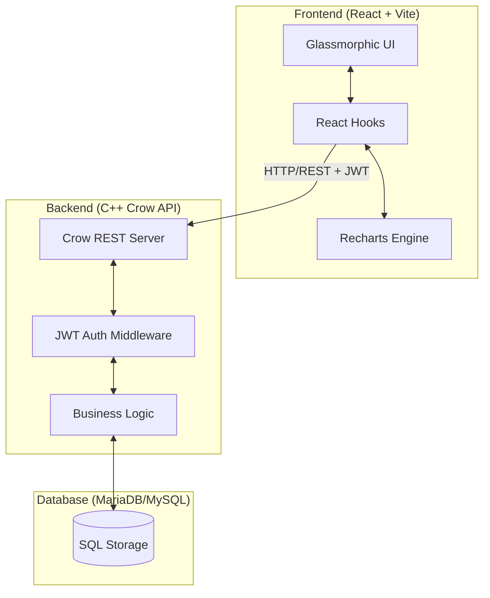

# Expensify - Full Stack Financial Management System

Expensify is a professional-grade, high-performance financial management application built with a C++ backend and a modern React frontend. It offers real-time expense tracking, budget management, savings monitoring, and financial goal setting with a stunning glassmorphic user interface.

## 🚀 Features

- **Real-time Dashboard**: Overview of total balance, monthly income, expenses, and savings with dynamic charts.
- **Transaction Management**: Detailed ledger with filtering, selection, and batch deletion capabilities.
- **Budget Tracking**: Set category-specific targets and monitor utilization in real-time.
- **Savings Vault**: Track deposits and withdrawals to your liquid savings with historical growth trends.
- **Financial Goals**: Set long-term aspirations with deadlines and priority-based tracking.
- **Personalized Settings**: Localization support (INR/USD/EUR/GBP), Dark/Light theme toggling, and multi-language support (English/Spanish/French).
- **Secure Authentication**: JWT-based session management and PBKDF2 password hashing.

---

## 🏗️ System Architecture

Expensify follows a decouple, modular architecture to ensure performance and scalability.



### Technology Stack
- **Frontend**: React 18, Vite, Recharts, Vanilla CSS (Custom Design System).
- **Backend**: C++ 17, Crow Framework (Asynchronous REST API), Asio.
- **Database**: MySQL/MariaDB with `mysql-connector-c`.
- **Security**: OpenSSL (PBKDF2 hashing & JWT HMAC validation).

---

## 📊 Database Structure

The system uses a relational schema designed for ACID compliance and data integrity.

### Tables

#### 1. `Users`
Stores account identifiers and security credentials.
- `id` (INT, PK): Unique user identifier.
- `display_name` (VARCHAR): User's preferred name.
- `email` (VARCHAR, Unique): Login credential.
- `password_hash` (VARCHAR): Secure PBKDF2 hash.

#### 2. `Expenses`
The core ledger for all income and outbound transactions.
- `id` (INT, PK): Transaction ID.
- `user_id` (INT, FK): Reference to User.
- `category_id` (INT, FK): Reference to Category.
- `amount` (DECIMAL): Transaction value.
- `description` (VARCHAR): User notes.
- `expense_date` (DATE): Timestamp of transaction.
- `type` (ENUM): 'income' or 'expense'.

#### 3. `Budgets`
Target caps for monthly spending.
- `id` (INT, PK): Budget ID.
- `user_id` (INT, FK): Reference to User.
- `category_name` (VARCHAR): Name of the category.
- `target_amount` (DOUBLE): Maximum spending limit.

#### 4. `Savings`
Tracking for liquid vault deposits.
- `id` (INT, PK): Entry ID.
- `user_id` (INT, FK): Reference to User.
- `amount` (DOUBLE): Deposit/Withdrawal amount.
- `description` (VARCHAR): Transaction label.
- `transaction_date` (DATE): Date of entry.

#### 5. `Goals`
Milestones for long-term financial aspirations.
- `id` (INT, PK): Goal ID.
- `user_id` (INT, FK): Reference to User.
- `title` (VARCHAR): Goal name.
- `target_amount` (DOUBLE): Total amount needed.
- `saved_amount` (DOUBLE): Current progress.
- `deadline` (DATE): Target completion date.
- `priority` (VARCHAR): Low, Medium, or High.

---

## 🛠️ Installation & Setup

### Prerequisites
- **Compiler**: MinGW-w64 or MSVC (C++ 17+).
- **Dependencies**: MariaDB Connector/C, OpenSSL.
- **Environment**: CMake 3.15+, Node.js (for frontend).

### Backend Setup
1. Clone the repository.
2. Ensure MySQL is running and create the `expense_tracker` database.
3. Build the project using CMake:
   ```bash
   mkdir build && cd build
   cmake ..
   make
   ./ExpenseTracker
   ```

### Frontend Setup
1. Navigate to the `frontend` directory.
2. Install dependencies:
   ```bash
   npm install
   ```
3. Start the development server:
   ```bash
   npm run dev
   ```

---

## 📜 License
This project is for educational and professional demonstration purposes. Feel free to fork and adapt it.
